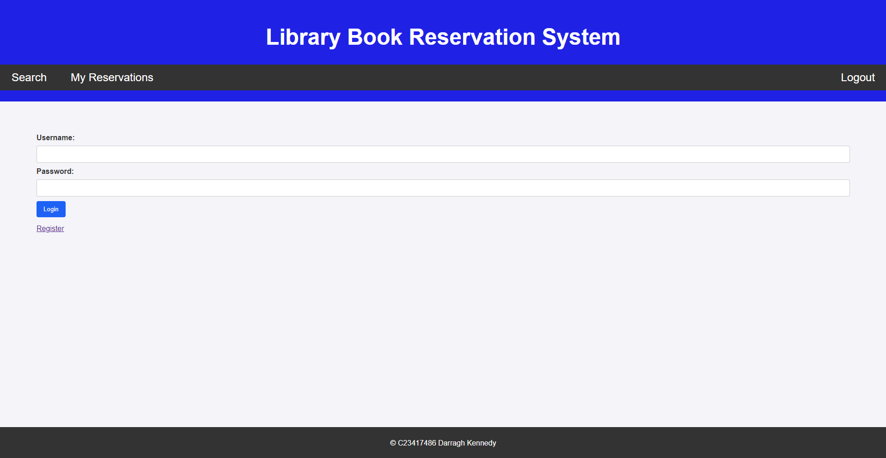
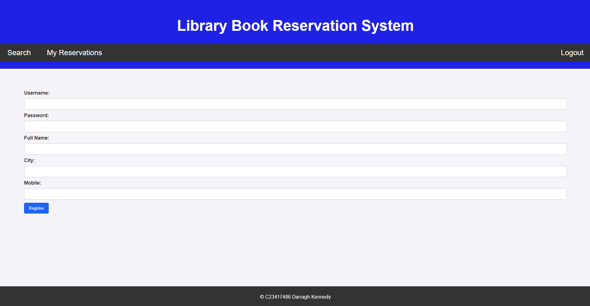
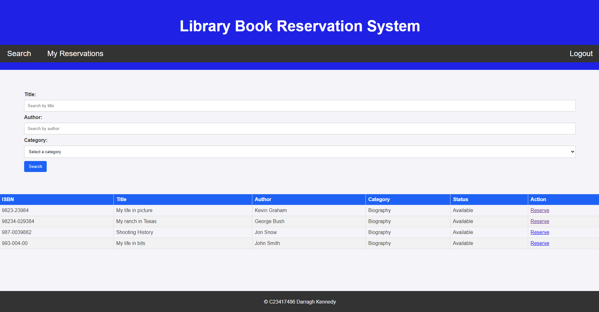
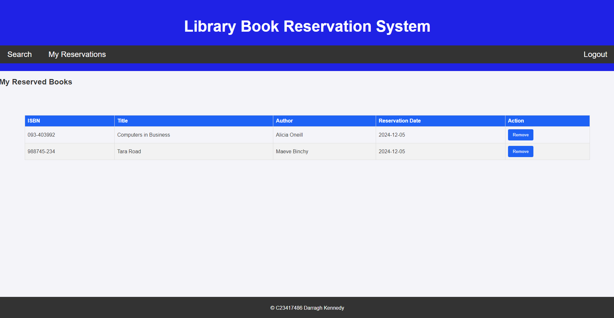

# Library Reservation System

#### A Library Book Reservation System built with PHP + MySQL (XAMPP).

#### I used MySQL to create a functional database to log users, books, categories of books and reservations. PHP files  included
#### HTML headings to build the site, and CSS was used to style the site in a simple and easy to understand format.
---

## Screenshots

### Login Page

### Register Page

### Reserve

### Reservations

---

## 🧰 Key Tech Skills
- PHP + HTML
- CSS (in `/css`)
- MySQL (exports in `/sql`)
- Includes (common PHP files in `/includes`)
